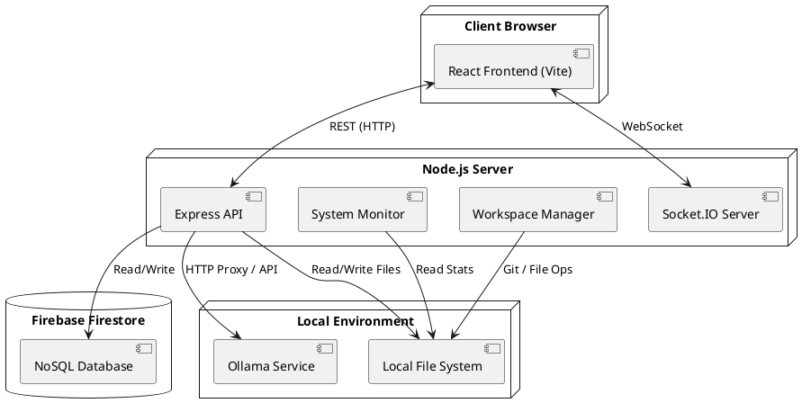
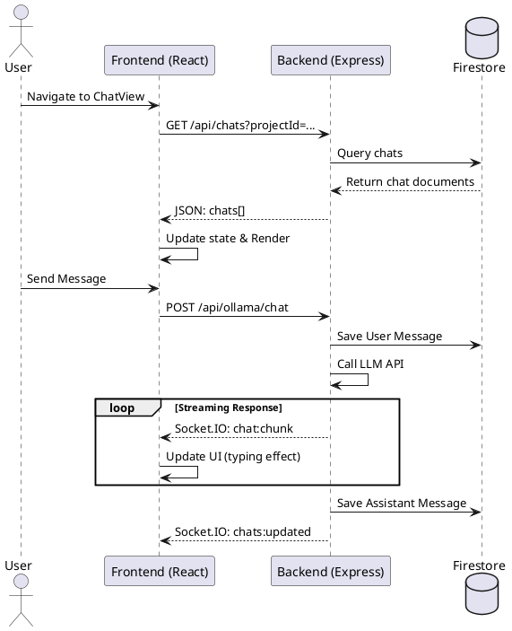
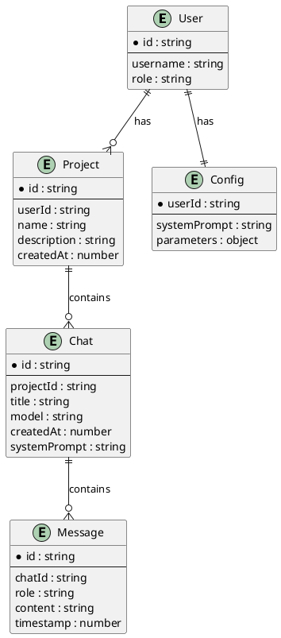
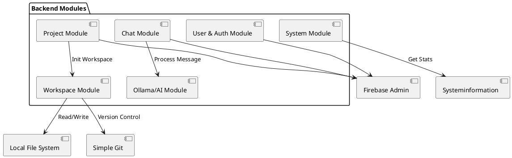
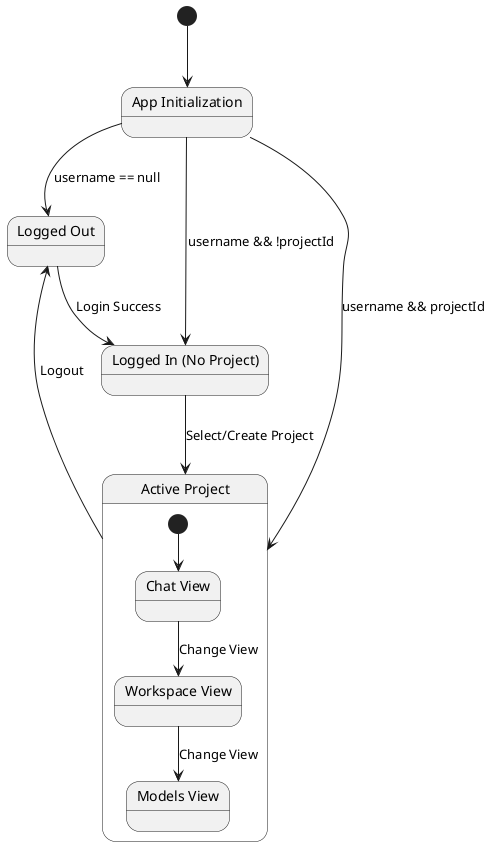
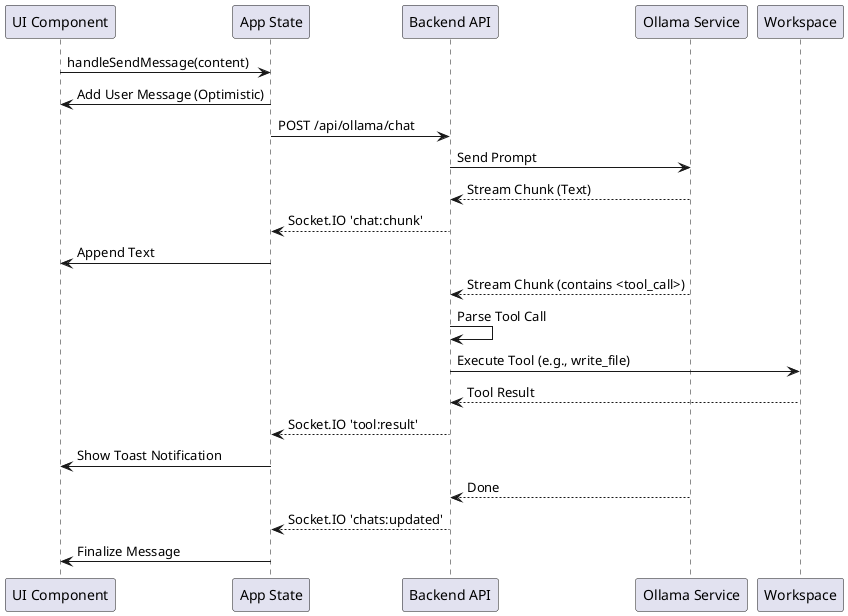
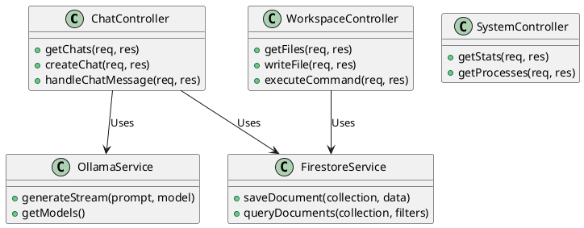

# Project UML Diagrams

## 1. Requirement Design

### 1.2 Structure System



---

## 2. Basic Design

### 2.1 Screen Transition Table

```plantuml
@startuml
[*] --> LoginView
LoginView --> ProjectListView : Login Success
ProjectListView --> ProjectInitView : Click "New Project"
ProjectListView --> ChatView : Select Project
ProjectInitView --> ChatView : Create Project

state MainApp {
  ChatView
  ModelsView
  PullView
  WorkspaceView
  SettingsView
  SystemControlView
}

ChatView --> ModelsView : Sidebar Click
ChatView --> PullView : Sidebar Click
ChatView --> WorkspaceView : Sidebar Click
ChatView --> SettingsView : Sidebar Click
ChatView --> SystemControlView : Sidebar Click

MainApp --> LoginView : Logout
@enduml
```

### 2.2 Data Item from Backend to Frontend (Base on Screen)



### 2.3 Data Schema (Firebase Firestore)



### 2.4 Module Backend



---

## 3. Detail Design

### 3.2 State Transition Table (Frontend State)



### 3.3 Function Detail Design



### 3.4 Agent Tool Calling Workflow (New)

```plantuml
@startuml
start
:AI generates response chunk;
if (Chunk contains <tool_call>?) then (yes)
  :Extract tool name and arguments;
  if (User is Admin?) then (yes)
    :Execute tool in Workspace;
    :Send result back to UI via Socket.IO;
    :Log tool execution;
  else (no)
    :Send "Access Denied" error to UI;
  fi
else (no)
  :Stream text to UI;
fi
stop
@enduml
```

### 3.5 Model Controller Design (Detail Back End)


